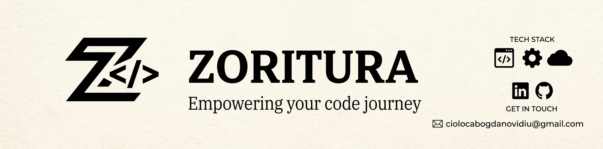
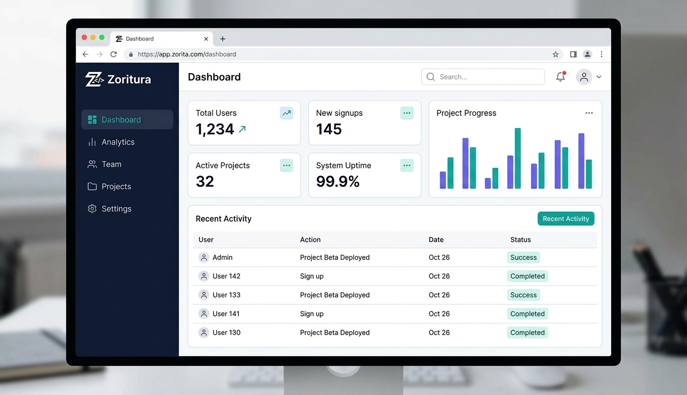

# Bogdan-Ovidiu Cioloca

### Software & Web Developer | Creator of Zoritura

Web development · Digital tools · Automation · Technical support

  
  
  

---

## About me

I am a software and web development enthusiast with a background in Computer
Science and Telecommunications.

I work on practical digital solutions involving web applications, backend
development, databases, automation and technical support.

I am currently developing **Zoritura**, an independent software project focused
on building useful and maintainable digital tools for individuals and small
organisations.

---

## Skills

  

| Area | Skills |
|---|---|
| Development | PHP, Laravel, JavaScript, Vue.js, Python |
| Web | HTML, CSS, responsive interfaces and web applications |
| Database | MySQL, SQL and relational database design |
| Tools | Git, GitHub, REST APIs and debugging |
| Additional | Automation, software testing, documentation, TCP/IP and DNS |

---

## Zoritura

  

**Zoritura** is an independent software project focused on practical web
solutions, digital tools and technical services.

### Main areas

- Web applications, websites and dashboards.
- Backend systems, APIs and database-driven tools.
- Automations, scripts and browser extensions.
- Software testing, debugging and documentation.
- Basic technical support and troubleshooting.

> Zoritura is currently an independent project in development.

---

## Selected work

### Web applications

Development of responsive interfaces, backend functionality, APIs and
database-driven features.

### Automation and digital tools

Development of small tools designed to simplify repetitive tasks and improve
productivity.

### Database projects

Design and implementation of relational databases using MySQL and SQL.

  

---

## Current focus

- PHP and Laravel backend development.
- JavaScript and Vue.js interfaces.
- MySQL database design and SQL.
- REST APIs and automation tools.
- Testing, debugging and technical documentation.
- Practical projects and continuous learning.

---

## Professional interests

I am open to opportunities and collaborations related to software development,
web development, backend development, digital services, technical support,
software testing and technology-related problem solving.

---

## Contact

- **LinkedIn:** [Connect with me](https://www.linkedin.com/in/bogdan-ovidiu-cioloca-368218372)
- **Email:** [ciolocabogdanovidiu@gmail.com](mailto:ciolocabogdanovidiu@gmail.com) or [zoritura00@gmail.com](mailto:zoritura00@gmail.com)
- **Location:** Italy
- **Availability:** Remote projects and professional opportunities
